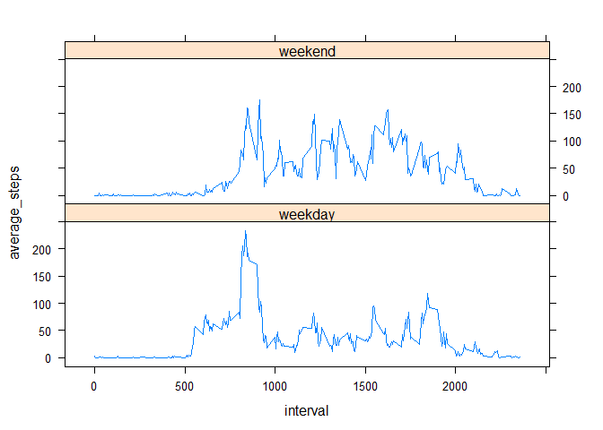

## Loading and preprocessing the data

The following code creates a folder in the current working directory for this project and sets the same as the working directory.


```r
if(!file.exists("reproducible_research_project_1")){
	dir.create("reproducible_research_project_1")
}

setwd(".\\reproducible_research_project_1")
```

The data for this assignment is available from this [link](https://d396qusza40orc.cloudfront.net/repdata%2Fdata%2Factivity.zip). The following chunk checks for the availability of this data in the working directory and if not present, downloads and unzips the same.


```r
if(!file.exists("data.zip")){
	fileUrl <- "https://d396qusza40orc.cloudfront.net/repdata%2Fdata%2Factivity.zip"
	download.file(fileUrl, destfile = "data.zip")
	dateDownloaded <- date()
	unzip("data.zip")
}
```

Now, we shall read the data from the unzipped csv file using read.csv() function and shows the structure of the imported dataset.


```r
#reads data from csv file
raw_data <- read.csv("activity.csv",na.strings = "NA", colClasses = c("numeric","character","numeric"))

#changes the date column to date format
raw_data$date <- as.Date(raw_data$date, "%Y-%m-%d")

str(raw_data)
```

```
## 'data.frame':	17568 obs. of  3 variables:
##  $ steps   : num  NA NA NA NA NA NA NA NA NA NA ...
##  $ date    : Date, format: "2012-10-01" "2012-10-01" ...
##  $ interval: num  0 5 10 15 20 25 30 35 40 45 ...
```

## What is mean total number of steps taken per day?

For answering this, we need to summarise the raw_data, as shown in the following chunk.


```r
library(dplyr)
```

```
## Warning: package 'dplyr' was built under R version 3.5.1
```

```
## 
## Attaching package: 'dplyr'
```

```
## The following objects are masked from 'package:stats':
## 
##     filter, lag
```

```
## The following objects are masked from 'package:base':
## 
##     intersect, setdiff, setequal, union
```

```r
daily_steps <- raw_data %>% group_by(date) %>% summarise(total_steps = sum(steps))
head(daily_steps)
```

```
## # A tibble: 6 x 2
##   date       total_steps
##   <date>           <dbl>
## 1 2012-10-01          NA
## 2 2012-10-02         126
## 3 2012-10-03       11352
## 4 2012-10-04       12116
## 5 2012-10-05       13294
## 6 2012-10-06       15420
```

As shown above, daily_steps informs us the total steps taken every day. The following histogram shows the distribution.


```r
library(ggplot2)
```

```
## Warning: package 'ggplot2' was built under R version 3.5.1
```

```r
g <- ggplot(daily_steps, aes(date, total_steps))
g + geom_col()
```

```
## Warning: Removed 8 rows containing missing values (position_stack).
```

<!-- -->

The following chunks calculate the mean and median total number of steps taken per day.


```r
mean_steps <- round(mean(daily_steps$total_steps, na.rm = TRUE),0)
mean_steps
```

```
## [1] 10766
```


```r
median_steps <- median(daily_steps$total_steps, na.rm = TRUE)
median_steps
```

```
## [1] 10765
```

The mean total number of steps taken every day is `mean_steps`.
The median total number of steps taken every day is `median_steps`.

## What is the average daily activity pattern?

For answering this, we need to summarise the raw_data, as shown in the following chunk.


```r
library(dplyr)
average_steps <- raw_data %>% group_by(interval) %>% summarise(average_steps = mean(steps,na.rm = TRUE))
head(average_steps)
```

```
## # A tibble: 6 x 2
##   interval average_steps
##      <dbl>         <dbl>
## 1        0        1.72  
## 2        5        0.340 
## 3       10        0.132 
## 4       15        0.151 
## 5       20        0.0755
## 6       25        2.09
```

The following chunk creates a time-series plot of the 5-minute interval (x-axis) and the average number of steps taken, averaged across all days (y-axis).


```r
g1 <- ggplot(average_steps, aes(interval, average_steps))
g1 + geom_line()
```

<!-- -->

Finding the exact 5-minute interval containing maximum number of steps on average across all the days in the dataset, requires us to identify the row where the maximum value of the average_steps column occurs in the average_steps dataframe.


```r
which.max(average_steps$average_steps)
```

```
## [1] 104
```

The corresponding interval in the average_steps dataframe in the interval column is the required interval.


```r
average_steps$interval[which.max(average_steps$average_steps)]
```

```
## [1] 835
```

## Imputing missing values

The total number of missing values in the dataset in the steps column are calculated as follows.


```r
missing_values_in_steps <- sum(is.na(raw_data$steps))
missing_values_in_steps
```

```
## [1] 2304
```

Although unlikely, but let's check NA values in date and interval columns as well. The total number of missing values in the dataset in the date and interval columns are calculated as follows.


```r
missing_values_in_date <- sum(is.na(raw_data$date))
missing_values_in_date
```

```
## [1] 0
```


```r
missing_values_in_interval <- sum(is.na(raw_data$interval))
missing_values_in_interval
```

```
## [1] 0
```

Hence, it is clear NA values are only present in steps column of the dataset. 

The total number of rows with missing values in the dataset are `missing_values_in_steps`.

For imputing the missing values, let's use the mean for that 5-minute interval. This has been calculated and stored already in the average_steps dataframe. The two dataframes - raw_data and average_steps - can be merged on column interval and consequently a new column named imputed_steps can be created which shall take the value of steps column, if not NA, else it shall take the value of average_steps.


```r
imputed_steps <- merge(raw_data, average_steps, by = "interval")
imputed_steps <- imputed_steps %>% mutate(imputed_steps = ifelse(is.na(steps),average_steps,steps))
```

```
## Warning: package 'bindrcpp' was built under R version 3.5.1
```

```r
imputed_steps <- imputed_steps %>% select(imputed_steps, date, interval)
imputed_steps$imputed_steps <- round(imputed_steps$imputed_steps,0)
imputed_steps <- imputed_steps %>% arrange(date, interval)
head(imputed_steps)
```

```
##   imputed_steps       date interval
## 1             2 2012-10-01        0
## 2             0 2012-10-01        5
## 3             0 2012-10-01       10
## 4             0 2012-10-01       15
## 5             0 2012-10-01       20
## 6             2 2012-10-01       25
```

For creating new histogram and calculating new mean and median with the imputed dataframe imputed_steps, we need to summarise the imputed_steps, as shown in the following chunk.


```r
library(dplyr)
daily_steps_imputed <- imputed_steps %>% group_by(date) %>% summarise(total_steps = sum(imputed_steps))
```

As shown above, daily_steps informs us the total steps taken every day. The following histogram shows the distribution.


```r
library(ggplot2)
g <- ggplot(daily_steps_imputed, aes(date, total_steps))
g + geom_col()
```

<!-- -->

The following chunks calculate the mean and median total number of steps taken per day.


```r
mean_steps_imputed <- round(mean(daily_steps_imputed$total_steps, na.rm = TRUE),0)
mean_steps_imputed
```

```
## [1] 10766
```


```r
median_steps_imputed <- median(daily_steps_imputed$total_steps, na.rm = TRUE)
median_steps_imputed
```

```
## [1] 10762
```

The mean total number of steps taken every day after imputing data is `mean_steps_imputed`, while earlier it was `mean_steps`.
The median total number of steps taken every day after imputing data is `median_steps_imputed`, while earlier it was `median_steps`.

As is clear, there is not a significant difference in the shift in mean and median, owing to the strategy for imputing we used.

## Are there differences in activity patterns between weekdays and weekends?

The following chunk adds another column to raw_data, signifying whether the day was a weekday or weekend day.


```r
raw_data <- raw_data %>% mutate(day.type = ifelse(weekdays(date) %in% c("Monday","Tuesday","Wednesday","Thursday","Friday"), "weekday", "weekend"))
```

Converting the new column as factor for creating the required plot in lattice package.


```r
raw_data$day.type <- as.factor(raw_data$day.type)
```

Creating the summary dataframe for the plot.


```r
day_interval_averages <- raw_data %>% group_by(day.type, interval) %>% summarise(average_steps = mean(steps, na.rm = T))
```

Creating the plot.


```r
library(lattice)
xyplot(average_steps~interval|day.type, day_interval_averages, layout = c(1,2), type = "l")
```

<!-- -->

